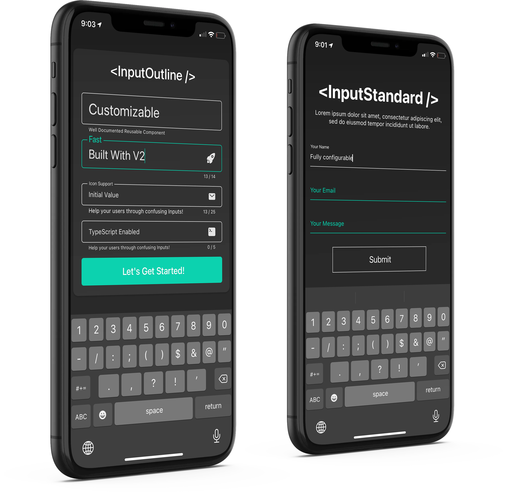

# React Native Input Outline

A performant TextInput with fully configurable options 🚀



I built this library because of all the performance issues I noticed in other TextInput libraries.
This library is extremely performant thanks to Reanimated v2. Leave a star if you enjoy it!

Performant React Native TextInputs built with Reanimated 2.

## Installation

```sh
yarn add react-native-reanimated@2.0.0-rc.0 react-native-input-outline
```

Reanimated v2 is required for this library to work.

## Usage

```js
import React, { useRef, useState } from 'react';
import { View, Button } from 'react-native';
import { InputOutline, InputStandard } from 'react-native-input-outline';

export default () => {
  const inputRef = useRef < InputOutline > null; // fully TypeScript enabled
  const [error, setError] = (useState < string) | (undefined > undefined);

  const showError = () => {
    setError('This is your error message!');
  };

  const hideError = () => {
    setError(undefined);
  };

  return (
    <View>
      <InputOutline
        ref={inputRef}
        error={error} // wont take effect until a message is passed
      />

      <InputStandard /> 

      <Button onPress={showError} title="Set Input Error" />
    </View>
  );
};
```

All vanilla [ReactNative TextInput Props](https://reactnative.dev/docs/textinput#props) along with regular `ref` usage are supported as well as others configured from this library shown below.

### Props

<!-- prettier-ignore -->
| Prop | Desription | Default | Type |
| :------------------ | :--------------------------------------------------------------------------------------------------------------------------------------------------------------------------------------------------- | ----------- | --------------------------------------------------------------- |
| `TextInput Props` | Inherited Props | | [TextInput Props](https://reactnative.dev/docs/textinput#props) |
| `activeColor` | Color when focused. | `'blue'` | `string` |
| `inactiveColor` | Color when blurred (not focused). | `'black'` | `string` |
| `errorColor` | Color that is displayed when in error state. | `'red'` | `string` |
| `backgroundColor` | Background color of the TextInput. | `'white'` | `string` |
| `fontSize` | Font size for TextInput. | `14` | `number` |
| `fontFamily` | Font Family for all fonts. | `undefined` | `string` |
| `fontColor` | Color of TextInput's font. | `black` | `string` |
| `error` | Error message is displayed. If anything is provided to error besides null or undefined, then the component is within an error state, thus displaying the error message provided here and errorColor. | `undefined` | `string | undefined | null` |
| `errorFontSize` | Font size of error text. | `10` | `number` |
| `errorFontFamily` | Font family of error text. | `undefined` | `string` |
| `assistiveText` | Will show a character count helper text and limit the characters being entered. | `undefined` | `string` |
| `assistiveTextFontSize` | Font size of assistive text. | `10` | `number` |
| `assitiveTextFontFamily` | Font family of assistive text. | `undefined` | `string` |
| `assistiveTextColor` | Font color of assistive text. | `inactiveColor` | `string` |
| `characterCount` | Will show a character count helper text and limit the characters being entered. | `undefined` | `number` |
| `characterCountFontSize` | Font size of character count text. | `10` | `number` |
| `characterCountFontFamily` | Font family of character count text. | `undefined` | `string` |
| `characterCountColor` | Font color of character count text. | `inactiveColor` | `string` |
| `paddingVertical` | Vertical padding for TextInput Container. Used to calculate animations.|`12`|`number` |
| `paddingHorizontal` | Horizontal padding for TextInput Container. | `16` | `number` |
| `roundness` | Border Radius for Container. | `5` | `number` |
| `trailingIcon` | Trailing Icon for the Input. | `undefined` | `React.FC` |
| `placeholder` | The string that will be rendered before text input has been entered.|`string`|

### Methods

| Method        | Description                                                                                                            |
| :------------ | :--------------------------------------------------------------------------------------------------------------------- |
| `focus()`     | Requests focus for the given input or view. The exact behavior triggered will depend on the platform and type of view. |
| `blur()`      | Removes focus from an input or view. This is the opposite of focus()                                                   |
| `isFocused()` | Returns current focus of input.                                                                                        |
| `clear()`     | Removes all text from the TextInput.                                                                                   |

## Contributing

See the [contributing guide](CONTRIBUTING.md) to learn how to contribute to the repository and the development workflow.

## License

MIT
